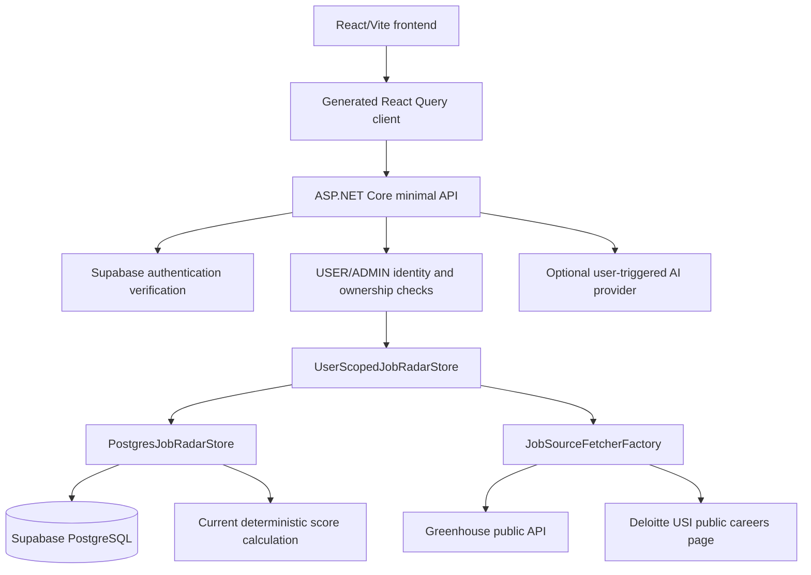

# Job Radar V1 Spec Reconciliation

**Reviewed**: 2026-09-06

This document reconciles the V1 specification and Greenhouse feature tasks with the verified repository state. It is the source of truth for scope classification before further Spec Kit implementation.

## Status Definitions

- **IMPLEMENTED**: Current product code provides the behavior. Performance or acceptance targets are not considered validated without evidence.
- **CURRENT FEATURE**: Belongs to the Greenhouse/source slice, but is incomplete or only partially evidenced.
- **PLANNED**: Valid future Job Radar work outside the current Greenhouse slice.
- **DEFERRED**: Explicitly postponed until a later phase or infrastructure decision.
- **OUT OF SCOPE**: Intentionally excluded from Job Radar V1.

## Current Architecture Summary

| Concern | Current source of truth | Verified state |
|---|---|---|
| API contract | [lib/api-spec/openapi.yaml](../../lib/api-spec/openapi.yaml) | OpenAPI is authoritative; generated React/Zod outputs are derived. |
| API runtime | [Program.cs](../../artifacts/api-server-dotnet/Program.cs) | Minimal API endpoints, auth boundary, registration, and scan entry points. |
| Persistence | [PostgresJobRadarStore.cs](../../artifacts/api-server-dotnet/Database/PostgresJobRadarStore.cs) and [UserScopedJobRadarStore.cs](../../artifacts/api-server-dotnet/Database/UserScopedJobRadarStore.cs) | Supabase PostgreSQL is active. The old in-memory plan is obsolete. |
| Authentication | [SupabaseAuthenticationHandler.cs](../../artifacts/api-server-dotnet/Auth/SupabaseAuthenticationHandler.cs) | Bearer tokens are verified through Supabase. |
| Authorization | [UserIdentityStore.cs](../../artifacts/api-server-dotnet/Auth/UserIdentityStore.cs) and [Program.cs](../../artifacts/api-server-dotnet/Program.cs) | USER/ADMIN roles exist; administration and scans are ADMIN-only; user data is scoped. |
| Source boundary | [IJobSourceFetcher.cs](../../artifacts/api-server-dotnet/Sources/IJobSourceFetcher.cs) and [JobSourceFetcherFactory.cs](../../artifacts/api-server-dotnet/Sources/JobSourceFetcherFactory.cs) | Greenhouse and Deloitte USI fetchers are registered. |
| Matching | [PostgresJobRadarStore.cs](../../artifacts/api-server-dotnet/Database/PostgresJobRadarStore.cs) | Existing job reads retain matching projections, but Greenhouse ingestion no longer loads matching configuration or writes job matches. |
| AI boundary | [IAiJobIntelligenceProvider.cs](../../artifacts/api-server-dotnet/IAiJobIntelligenceProvider.cs) | Optional, backend-only, user-triggered analysis; automatic scans do not invoke it. |
| Frontend | [App.tsx](../../artifacts/job-radar/src/App.tsx) | Dashboard, jobs, companies, sources, profile, matching, notifications, and source-health screens exist. |
| Generated client | [lib/api-client-react/src/generated](../../lib/api-client-react/src/generated) | Never edit generated files manually; regenerate from OpenAPI. |

## Implemented Feature Inventory

- Supabase sign-in/sign-up and authenticated React/Vite workspace.
- USER and ADMIN identity records with ADMIN-only company/source administration and scans.
- PostgreSQL tables for users, companies, sources, jobs, profiles, matching configurations, job matches, notifications, and workspace settings.
- Company/source CRUD and enable/disable operations.
- Dashboard, job detail, job search, status/location/workplace filters, and generated API client integration.
- Candidate profile and matching configuration persistence with total-weight validation.
- Deterministic ingestion-time scoring with score, match status, breakdown, matched skills, and missing skills.
- Manual single-source and scan-all endpoints.
- Greenhouse public API fetching, normalization, malformed-response handling, timeout, bounded transient retries, and truthful user-agent.
- Deloitte USI public career-page fetching with pagination and request pacing.
- Source status, last-fetch/last-success values, fetch duration, fetched count, malformed-record diagnostics, and error display.
- Notification history storage/read endpoint, but no email delivery or notification orchestration.
- Optional user-triggered AI job analysis, separate from automatic scans.

## Current Greenhouse Feature Scope

The current feature validates the Greenhouse path on top of the existing PostgreSQL product:

- Greenhouse public-board configuration and board-token derivation.
- Fetching, normalization, malformed-record handling, and bounded transient retries.
- Idempotent job upsert using the current job identity convention.
- Source health updates and scan failure isolation.
- Existing API response shapes and generated client behavior remain unchanged.
- Focused verification of the existing Greenhouse path.

It does **not** replace PostgreSQL, introduce a new matcher abstraction, add email delivery, or add an hourly hosted scheduler.

## Future Roadmap

- Add remaining permitted source types such as Lever after their adapter contracts and access rules are specified.
- Extract deterministic matching behind a dedicated interface only if future matching work requires it.
- Add email delivery, notification eligibility, suppression, retries, and complete user-scoped notification lifecycle behavior.
- Add a hosted/background hourly scheduler invoking the same scan application service.
- Add pagination, broader job filters, and large-dataset performance measurement.
- Add migration-managed schema evolution and a separate fetch-history model if operational history requires it.

## Deferred and Out of Scope

| Item | Classification | Reason |
|---|---|---|
| Hourly background scheduler | DEFERRED | Manual `/api/scheduler/scan` exists; no hosted scheduler exists. |
| Email delivery and delivery retry | DEFERRED | Notification rows/read API exist; no sender or orchestration exists. |
| Lever and generic/structured HTML adapters | PLANNED | Contract enum values exist, but no registered fetchers exist. |
| 10,000-job / 2-second performance target | DEFERRED | No benchmark or validation evidence exists. |
| Development seed data | DEFERRED | No backend seed routine was found. |
| Browser automation, CAPTCHA/anti-bot bypass, private APIs, automatic LLM matching | OUT OF SCOPE | Prohibited by the constitution and source-access policy. |

## Requirement-to-Task Coverage Matrix

Status describes the complete requirement, not an unverified partial implementation.

| Requirement | Current status | Current feature? | Task | Notes |
|---|---|---:|---|---|
| FR-001 | IMPLEMENTED | No | — | Company CRUD exists in `Program.cs` and PostgreSQL store. |
| FR-002 | IMPLEMENTED | No | — | Source CRUD and health fields exist. |
| FR-003 | PLANNED | Yes, Greenhouse subset | T016-T018 | Greenhouse and Deloitte exist; Lever/structured sources do not. |
| FR-004 | CURRENT FEATURE | Yes | T019-T021 | Scan exists; general exception handling rethrows after health update. |
| FR-005 | CURRENT FEATURE | Yes | T005, T016-T017 | Normalized fields exist, but explicit `lastSeenAt` is absent. |
| FR-006 | IMPLEMENTED | Yes | T013, T017 | Greenhouse normalizer skips malformed records. |
| FR-007 | CURRENT FEATURE | Yes | T007, T019, T023 | Upsert exists; identity uses current job IDs rather than planned repository abstraction. |
| FR-008 | PLANNED | No | — | Search/basic filters exist; pagination and all requested filters do not. |
| FR-009 | IMPLEMENTED | No | T032 | Job detail route and response exist. |
| FR-010 | IMPLEMENTED | No | T027, T029-T031 | Profile persistence and UI exist. |
| FR-011 | IMPLEMENTED | No | T026, T029 | Weight-total and threshold validation exist; non-negative weight validation needs verification. |
| FR-012 | IMPLEMENTED | No | T025, T028 | Automatic matching is deterministic; optional user AI is separate. |
| FR-013 | PLANNED | No | T025-T032 | Score fields exist; human-readable reasons and explicit threshold explanation do not. |
| FR-014 | PLANNED | No | T025-T026, T028 | Experience, freshness, and workplace matching are incomplete. |
| FR-015 | IMPLEMENTED | No | T026 | Unknown experience is not an automatic mismatch in the current scorer. |
| FR-016 | CURRENT FEATURE | Yes | T019, T023 | New-job count exists; default notification initiation does not. |
| FR-017 | PLANNED | No | T037-T040 | No email delivery service exists. |
| FR-018 | PLANNED | No | T033-T039 | Notification table/read API exist; suppression/lifecycle orchestration does not. |
| FR-019 | IMPLEMENTED | Yes | T021 | Single-source and all-source scan endpoints exist. |
| FR-020 | DEFERRED | No | T021 | Manual endpoint exists; no hourly background scheduler exists. |
| FR-021 | IMPLEMENTED | Yes | T019, T022 | Source health persists last attempt, last success, duration, consecutive failures, errors, counts, and malformed diagnostics. |
| FR-022 | IMPLEMENTED | Yes | T008, T010, T018 | Greenhouse timeout, retries, pacing, and user-agent exist. |
| FR-023 | CURRENT FEATURE | Yes | T041-T042 | Logging exists; operational coverage is incomplete. |
| FR-024 | IMPLEMENTED | No | T047 | PostgreSQL persists core entities; separate fetch-history persistence is absent. |
| FR-025 | DEFERRED | No | — | No verified seed implementation exists. |
| FR-026 | IMPLEMENTED | No | T043-T044 | OpenAPI and generated clients cover current service behavior. |
| FR-027 | IMPLEMENTED | No | T002, T040 | Configuration uses environment/.NET configuration. |
| FR-028 | PLANNED | No | T009-T015, T025-T035 | Some Greenhouse tests exist; the complete focused suite is absent. |
| SC-001 | IMPLEMENTED | No | T001-T024 | Workflow exists; under-five-minute timing is not measured. |
| SC-002 | CURRENT FEATURE | Yes | T012-T019 | Normalization exists; 99% accuracy is not validated. |
| SC-003 | CURRENT FEATURE | Yes | T009, T023 | Idempotent upsert exists; notification suppression does not. |
| SC-004 | DEFERRED | No | — | No 10,000-job benchmark exists. |
| SC-005 | PLANNED | No | T025-T032 | Breakdown is visible; reasons and usability target are not validated. |
| SC-006 | CURRENT FEATURE | Yes | T015, T019-T021 | Isolation is intended and partial; multi-source test evidence is pending. |
| SC-007 | PLANNED | No | T033-T040 | Email delivery is absent. |
| SC-008 | CURRENT FEATURE | Yes | T024-T032 | Main workflow exists; end-to-end error verification is pending. |
| SC-009 | DEFERRED | No | — | No hourly workflow exists. |
| SC-010 | IMPLEMENTED | No | T021, T028 | Automatic scans do not require AI; explicit AI is outside scanning. |

## Remaining Ambiguities

1. Whether this feature should complete only the Greenhouse path or also close the partial matching and notification gaps grouped under US2/US3.
2. Whether FR-005 needs a distinct `lastSeenAt` field.
3. Whether FR-024 needs a separate fetch-history table or whether source health fields are sufficient.
4. Whether optional user-triggered AI is part of V1 or a separate product capability.
5. Whether failure isolation must continue after all exceptions or only unsupported/fetch-specific failures.

Resolve these points before generating a replacement task list.
